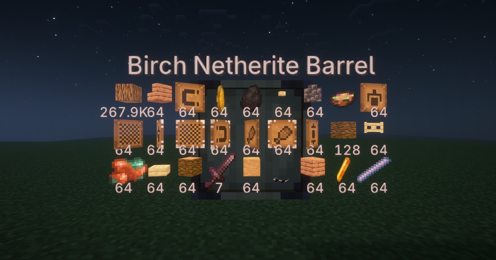
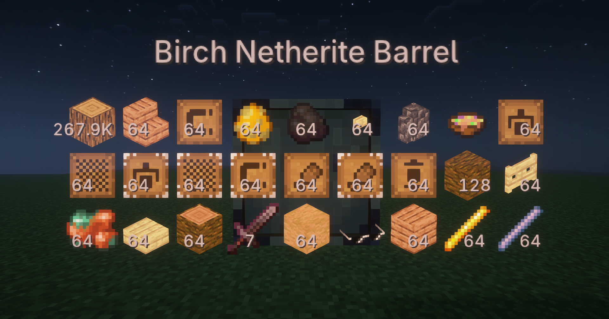
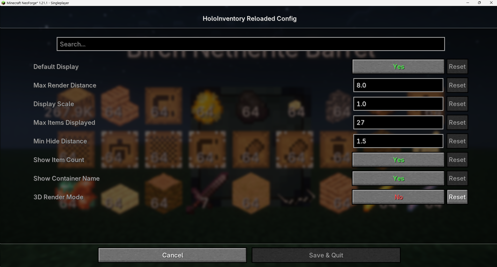

HoloInventory Reloaded - A Minecraft mod for holographic inventory display.

[中文](README_cn.md) | English

This mod is a high-version remaster of [**HoloInventory**](https://www.curseforge.com/minecraft/mc-mods/holoinventory). When you point your cursor at a container (such as chests and hoppers), it will display the items inside the container above it.

Effect Showcase:

(3D Display)
2D Display
(2D Display)

(Config Interface, requires Cloth Config API)

I used the glasses model from the Glasses mod created by Nova-Committee Team. In accordance with this mod's license agreement, the mod itself has been open-sourced under the AGPL-3.0 license.
