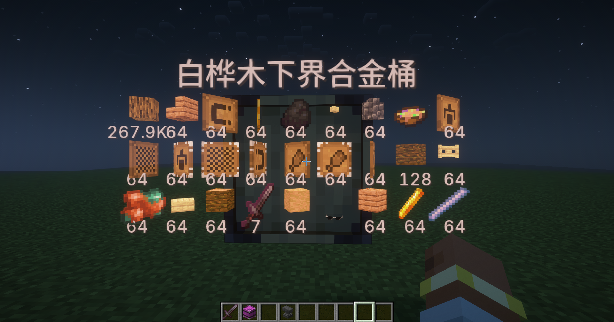
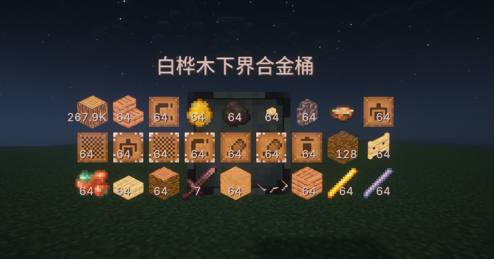
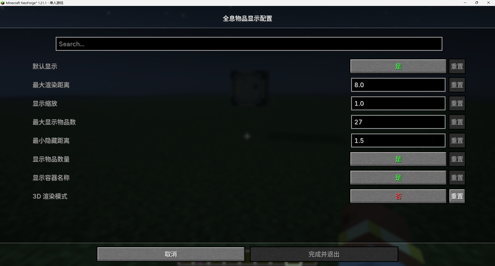

HoloInventory Reloaded - 物品显示重置版

中文 | [English](README.md)

此模组为[**物品显示**](https://www.curseforge.com/minecraft/mc-mods/holoinventory)的高版本重置版，当你的指针指向一个容器（如箱子和漏斗）时，它的头上会显示容器里面的物品。

效果展示：

(3D显示)
2D显示
(2D显示)

(配置界面，需要加入Cloth Config API)
